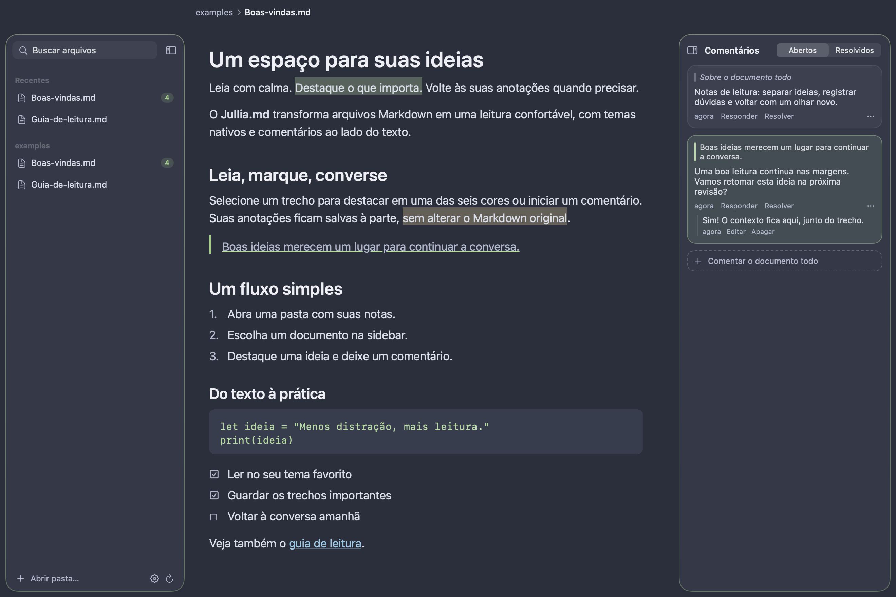
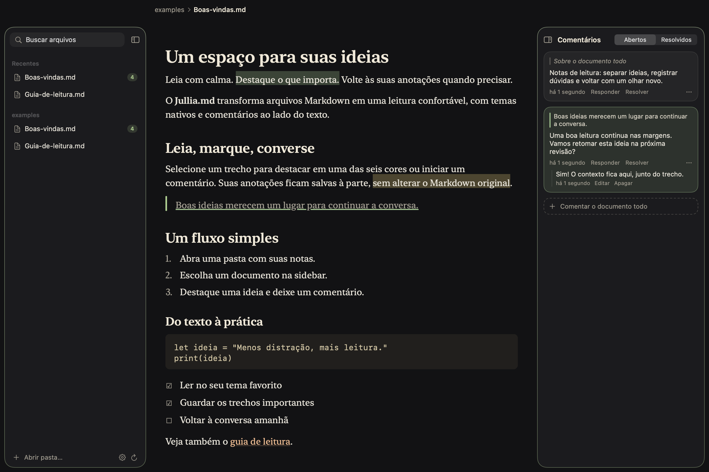
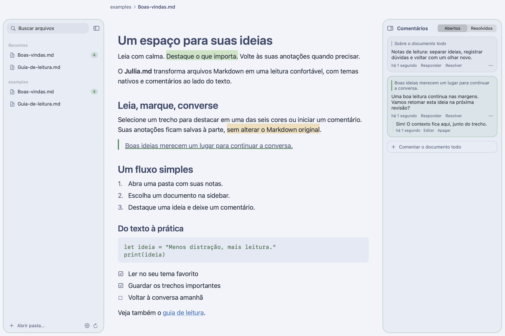
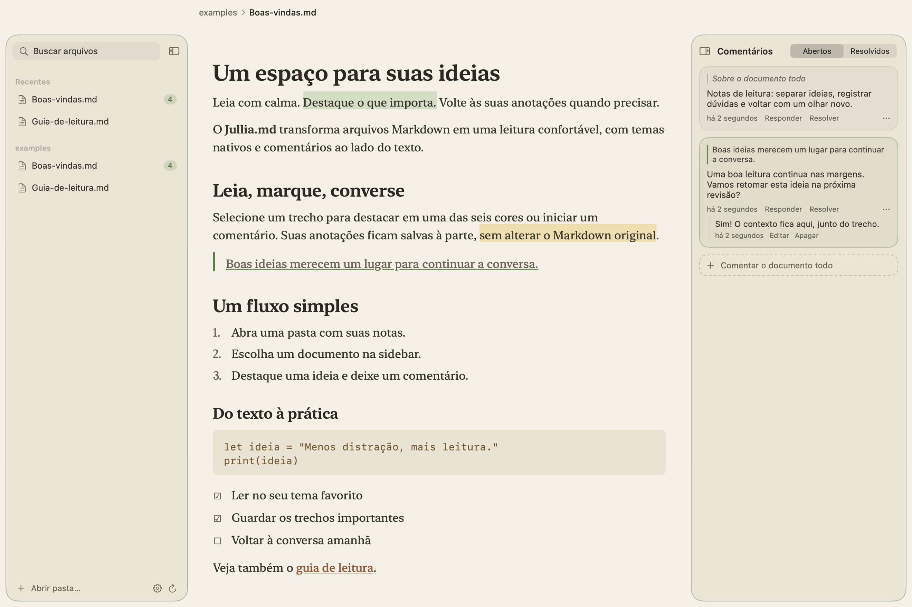
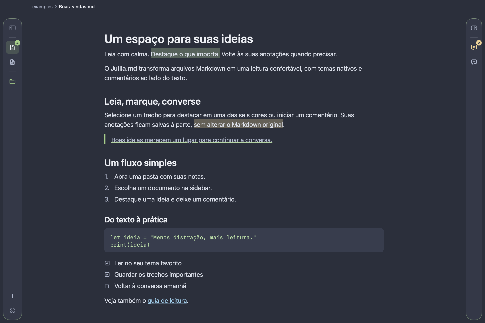

# Jullia.md

**Leia com calma. Destaque o que importa. Continue a conversa nas margens.**

Jullia.md é um visualizador de Markdown nativo para macOS, feito em SwiftUI e AppKit. Abra suas notas, escolha um tema e adicione destaques e comentários sem modificar os arquivos originais.



**macOS 27+ · Swift 6.4 · Interface em português · Versão 0.4.0**

[Instalação](#instalação) · [Como usar](#como-usar) · [Temas](#temas-e-aparência) · [Atalhos](#atalhos) · [Desenvolvimento](#desenvolvimento)

## O que você pode fazer

- **Ler Markdown com controles nativos:** títulos, listas, tarefas, tabelas, citações, blocos de código, links e imagens locais.
- **Navegar por pastas:** árvore de arquivos, busca por nome, documentos recentes e contadores de anotações.
- **Destacar em seis cores:** amarelo, verde, azul, rosa, roxo e laranja, com uma barra flutuante sobre a seleção.
- **Comentar trechos ou o documento inteiro:** responder, editar, resolver, reabrir e escolher a cor de cada conversa.
- **Acompanhar alterações externas:** recarregamento automático e tentativa de reencontrar os trechos anotados após uma edição.
- **Ajustar a leitura:** quatro temas, tamanho do texto, largura da coluna e transparência independente para cada painel.
- **Recolher as sidebars:** mais espaço para ler, com acesso rápido a arquivos e comentários pelas barras laterais.

O app funciona com arquivos locais e mantém as anotações em SQLite. Não exige conta nem um serviço de sincronização.

## Instalação

### Requisitos

| Requisito | Versão |
| --- | --- |
| macOS | 27 ou superior |
| Xcode completo | 27, com o SDK do macOS 27 e `actool` |
| Swift | 6.4 ou superior |

O projeto foi validado em Apple Silicon com macOS 27.0.1, Xcode 27.0 e Swift 6.4. O script compila para a arquitetura do Mac usado; não gera um binário universal. As Command Line Tools isoladas não substituem o Xcode completo para compilar o ícone.

### Compilar e abrir

```bash
git clone https://github.com/rheav/jullia-md.git
cd jullia-md
swift test
./scripts/build-app.sh
open build/Jullia.md.app
```

O Swift Package Manager baixa as dependências na primeira compilação. As versões resolvidas estão em [`Package.resolved`](Package.resolved).

O script cria `build/Jullia.md.app` em modo release, compila o ícone em camadas e aplica uma assinatura ad-hoc. Essa assinatura permite o uso local; o bundle não é notarizado para distribuição. A versão do app vem de [`VERSION`](VERSION).

### Instalar ou atualizar em Applications

```bash
./scripts/install.sh
```

O instalador compila o app, pede que uma cópia em execução encerre normalmente, substitui `/Applications/Jullia.md.app`, registra o bundle no macOS e o reabre. As preferências e anotações ficam fora do bundle e são preservadas.

Para instalar sem abrir ao final:

```bash
./scripts/install.sh --no-open
```

## Como usar

### Abrir seus documentos

Use **⌘O** para abrir arquivos ou **⇧⌘O** para adicionar uma pasta. Também é possível arrastar arquivos e pastas para a sidebar ou para a tela inicial, e abrir um `.md` pelo Finder com **Abrir com → Jullia.md**.

Para experimentar, abra a pasta [`examples`](examples) e selecione [`Boas-vindas.md`](examples/Boas-vindas.md). Os textos de demonstração vêm sem anotações; os comentários das imagens são criados pelo gerador de screenshots.

A árvore reconhece `.md`, `.markdown`, `.mdown` e `.mkd`, ignora arquivos ocultos e links simbólicos e omite pastas sem Markdown. Diretórios de build e dependências, como `node_modules`, `.build`, `build`, `dist`, `DerivedData` e `Pods`, ficam fora da navegação. A busca filtra nomes de arquivos, sem diferenciar maiúsculas ou acentos.

### Destacar e comentar

Selecione um trecho para abrir a barra de marcação. Escolha uma cor para destacar, o balão para comentar ou o botão de cópia para copiar o texto. O menu contextual também oferece essas ações. Clique em um destaque existente para mudar sua cor ou removê-lo.

Na sidebar de comentários, você pode iniciar uma conversa sobre o documento inteiro, responder a uma conversa existente e alternar entre **Abertos** e **Resolvidos**. Clicar em um comentário vinculado a um trecho leva até sua posição no documento.

### Editar no seu editor favorito

Jullia.md é um leitor: a edição do Markdown acontece em outro app. Com o recarregamento automático ativado, alterações no disco atualizam a leitura. **⌘R** força uma atualização do documento e das pastas.

Cada anotação guarda o texto selecionado, sua posição e um pouco do contexto ao redor. Se o trecho mudar de posição, o app tenta reencontrá-lo. Quando não consegue, preserva a anotação na seção **Órfãos**. A recuperação depende de ainda haver texto suficiente para identificar o trecho.

## Temas e aparência

| Polar | Ink |
| --- | --- |
|  |  |
| Escuro, azul acinzentado, fonte de sistema. | Escuro, tons de grafite, fonte serifada. |

| Snow | Paper |
| --- | --- |
|  |  |
| Claro, neutro, fonte de sistema. | Claro, quente, fonte serifada. |

Em **Ajustes → Aparência**, escolha um tema fixo ou acompanhe o modo claro/escuro do macOS com um tema para cada modo. A transparência da janela, da sidebar de arquivos e da sidebar de comentários pode ser ajustada separadamente, de **0% a 85%**. O app respeita **Reduzir transparência** do macOS.

Em **Ajustes → Geral**, ajuste o texto de **12 a 26 pt**, a largura desejada da coluna de **520 a 1100 pt**, o recarregamento automático e a reabertura da sessão anterior.

### Mais espaço para ler

Recolha os painéis para manter apenas as barras de ícones. Passe o ponteiro sobre a barra de comentários para uma prévia, ou clique para mantê-la aberta.



As imagens são snapshots das views de produção, renderizadas em AppKit com conteúdo de demonstração. Usam superfícies opacas para não depender do fundo da área de trabalho; o desfoque do Liquid Glass aparece ao ativar a transparência no app. Veja [como gerar as imagens novamente](docs/screenshots/README.md).

## Atalhos

| Atalho | Ação |
| --- | --- |
| ⌘O | Abrir arquivo ou pasta |
| ⇧⌘O | Adicionar pasta |
| ⌘R | Recarregar documento e pastas |
| ⇧⌘H | Destacar a seleção com a última cor usada |
| ⌥⌘M | Comentar a seleção; sem seleção, comentar o documento |
| ⌃⌘S | Expandir ou recolher arquivos |
| ⌥⌘0 | Expandir ou recolher comentários |
| ⌃⌘1 / 2 / 3 / 4 | Polar / Ink / Snow / Paper |
| ⌘+ / ⌘− | Aumentar ou diminuir o texto |
| ⌘0 | Restaurar o texto para 16 pt |
| ⌘, | Abrir ajustes |
| ⌘↩ | Enviar o comentário em edição |
| Esc | Cancelar a edição de comentário ou dispensar a prévia lateral |

## Seus dados

| Dado | Onde fica |
| --- | --- |
| Arquivos Markdown | Nas pastas que você abriu; o app não os sobrescreve |
| Destaques e comentários | `~/Library/Application Support/Jullia/annotations.sqlite` |
| Preferências, pastas e arquivos recentes | UserDefaults, domínio `dev.rheav.jullia` |

As anotações são associadas ao caminho absoluto do arquivo, com links simbólicos resolvidos. **Mover ou renomear um documento não transfere suas anotações automaticamente.**

Para fazer backup, encerre o app e copie a pasta inteira `~/Library/Application Support/Jullia`, além dos seus documentos. O banco usa WAL; enquanto aberto, pode haver arquivos auxiliares `annotations.sqlite-wal` e `annotations.sqlite-shm`.

Até a versão 0.2.0, o projeto se chamava **Marknord**. Na primeira abertura como Jullia.md, a migração copia as preferências antigas e, se ainda não existir a pasta de dados Jullia, copia os dados de `~/Library/Application Support/Marknord`. Os dados antigos permanecem no local original.

## Limitações atuais

- Uma janela principal com um documento aberto por vez, sem abas ou edição de Markdown.
- A busca da sidebar procura nomes de arquivos; não indexa o conteúdo das pastas.
- Imagens locais são renderizadas. Imagens remotas aparecem como texto alternativo, sem download automático.
- Blocos de código usam fonte monoespaçada, sem realce de sintaxe por linguagem.
- HTML não é interpretado como uma página web; comentários HTML em blocos separados são omitidos e o restante aparece como texto. Diagramas Mermaid e fórmulas matemáticas não têm renderização dedicada.
- As tarefas do Markdown são apresentadas para leitura, sem alterar seus checkboxes no arquivo.
- Não há sincronização integrada, exportação de anotações ou colaboração entre dispositivos.
- A varredura de pastas tem limite de profundidade de 12 níveis; prefira abrir pastas de notas ou projetos específicos.

## Desenvolvimento

```bash
swift build                  # Compilação de desenvolvimento
swift test                   # Testes do core e da integração com o app
CONFIG=debug ./scripts/build-app.sh
./scripts/screenshots.sh     # Atualiza os cinco PNGs da documentação
```

Abra [`Package.swift`](Package.swift) no Xcode para trabalhar no pacote. Para testar a integração com Finder, o ícone e a identidade de preferências do app instalado, use o bundle produzido por `build-app.sh`.

```text
Sources/
  Jullia/                   App SwiftUI, modelos, preferências e observação de arquivos
    Views/                  Leitor AppKit, sidebars, cards, controles e ajustes
  JulliaCore/               Renderer Markdown, temas, âncoras, SQLite e árvore de arquivos
Tests/
  JulliaCoreTests/          Renderização, layout TextKit, âncoras, banco e navegação
  JulliaAppTests/           Persistência de sessão, recarregamento e snapshots opcionais
assets/icon/AppIcon.icon/   Ícone em camadas do Icon Composer
examples/                  Documentos para experimentar o app
scripts/                   Build do bundle, instalação e screenshots
docs/                      Arquitetura, imagens e especificação original
```

O parser usa `swift-markdown` 0.9.0; SQLite vem do sistema. A interface combina SwiftUI com um `NSTextView` em TextKit 1, sem WebView. Os detalhes do fluxo de renderização e das anotações estão em [Arquitetura](docs/architecture.md). Para contribuir, consulte [CONTRIBUTING.md](CONTRIBUTING.md).

## Resolução de problemas

**O Swift não reconhece a versão do pacote ou o SDK.** Confira `swift --version`, `xcodebuild -version` e `xcode-select -p`. Se o Xcode correto estiver em `/Applications/Xcode.app`, você pode selecionar suas ferramentas apenas para o comando:

```bash
DEVELOPER_DIR=/Applications/Xcode.app/Contents/Developer ./scripts/build-app.sh
```

**A compilação reclama de caminhos de uma pasta antiga.** Se você moveu o checkout, execute `swift package clean` e compile novamente para reconstruir os artefatos locais.

**O arquivo não aparece na árvore.** Verifique a extensão, se está em uma pasta ignorada ou oculta e se é um link simbólico. Use **⌘R** para atualizar.

**Uma anotação perdeu o trecho.** Procure em **Órfãos**. Se você moveu ou renomeou o arquivo, abrir o caminho original volta a usar a chave das anotações anteriores.

**O instalador informa que o app ainda está em execução.** Encerre Jullia.md normalmente e execute a instalação novamente. O script não força o encerramento.
